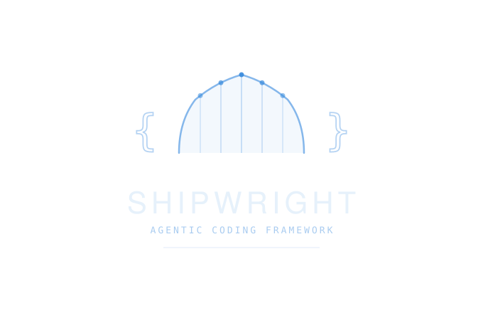

<p align="center">
  
</p>

<p align="center">
  An agentic coding framework for <a href="https://claude.ai/code">Claude Code</a>.
</p>

---

Shipwright adds structured workflows, safety guardrails, and team coordination to Claude Code. It works with any codebase — new or existing — and doesn't affect engineers who aren't using Claude.

```bash
cd your-project
claude
```
```
/onboard
```

---

## How It Works

**Getting oriented:**
`/onboard` analyzes the codebase, checks your environment, and shows what commands are available.

**Building features:**
`/new-feature <desc>` follows an explore-plan-code-commit workflow. `/implement PROJ-123` does the same but starts from a Jira ticket.

**Code review:**
`/review` checks for bugs, security issues, and style problems against a structured checklist.

**Parallel work:**
`/team create PROJ-1 PROJ-2` spins up agents working on separate stories. `/team template review` runs security, performance, and test reviews in parallel.

**Safety:**
Hooks enforce rules that Claude can't bypass — no commits to main, no force pushes, no editing `.env` files. These aren't instructions; they're hard blocks.

---

## Getting Started

### New project

```bash
gh repo create my-project --template jettwein/shipwright --public
cd my-project && claude
```

Customize `CLAUDE.md` with your project's conventions, then optionally run `/setup` to configure integrations (Jira, GitHub Actions, Slack).

### Existing codebase

One-time setup (once per machine):
```bash
curl -sf https://raw.githubusercontent.com/jettwein/shipwright/main/scripts/bootstrap.sh | bash
```

Then in any repo:
```
/onboard    # analyze the codebase, check environment
/adopt      # add the workflow files
```

`/adopt` lets you choose how much to install:

| Tier | What's added | Impact on teammates |
|------|-------------|---------------------|
| **Lightweight** | `.claude/` only | None — invisible to non-Claude users |
| **Standard** | + `CLAUDE.md` + `scripts/` | Minimal — markdown docs and shell scripts |
| **Full** | + GitHub Actions + Slack | Moderate — PRs get auto-reviewed |

---

## Commands

### Core

| Command | Description |
|---------|-------------|
| `/onboard` | Guided codebase tour, environment check, first task suggestion |
| `/new-feature <desc>` | Explore, plan, implement, commit — with approval gates |
| `/review` | Code review with checklist and ADR compliance check |
| `/help [topic]` | Contextual help and troubleshooting |
| `/doctor` | Diagnose setup issues |
| `/team template review` | Parallel review: security, performance, tests |
| `/team template research` | Investigate approaches, synthesize recommendation |
| `/adr <subcommand>` | Manage architecture decision records |

### With Jira

| Command | Description |
|---------|-------------|
| `/implement PROJ-123` | Ticket to PR, end-to-end |
| `/implement-all PROJ` | Work through backlog in dependency order |
| `/jira-task PROJ-123` | Plan a ticket (without implementing) |
| `/init-project PROJ` | Turn requirements.md into Jira stories |
| `/team create PROJ-1 PROJ-2` | Parallel agents, one per story |

### Setup

| Command | Description |
|---------|-------------|
| `/adopt` | Add Shipwright to an existing repo |
| `/setup` | Configure integrations (Jira, GitHub Actions, Slack) |

---

## Safety Guardrails

Hooks run before every action. Claude cannot bypass them.

| Blocked | Reason |
|---------|--------|
| Commit on `main`/`master` | Feature branch workflow |
| `git push --force` | Shared history protection |
| Edit `.env`, lockfiles, credentials | Protected files |
| `rm -rf` outside project | Accidental destruction |
| `git reset --hard` | Work loss prevention |
| `DROP TABLE`, `TRUNCATE` | Destructive DB operations |
| `sudo` | No privilege escalation |

---

## What Runs Automatically

**Auto-formatting** — Every file edit is formatted using the project's formatter (Prettier, Black, gofmt, rustfmt). Uses whatever's installed, silent if nothing is.

**Session context** — On startup, Claude sees current branch, uncommitted changes, open PRs, recent commits, and in-progress Jira tickets. After context compaction, core workflow rules are re-injected.

**Desktop notifications** — Native OS alerts when Claude needs your input.

**Path-scoped rules** — Domain rules in `.claude/rules/` load only when Claude touches matching files:

| Rule | Loads when editing |
|------|-------------------|
| `frontend.md` | `*.tsx`, `*.jsx`, `src/components/` |
| `api.md` | `src/api/`, `src/routes/` |
| `database.md` | `migrations/`, `*.sql`, `prisma/` |
| `tests.md` | `*.test.*`, `*.spec.*` |
| `infrastructure.md` | `terraform/`, `Dockerfile`, CI workflows |

---

## Multi-Agent Development

**Agent teams** — A lead session coordinates teammates with shared task lists:

```
/team create PROJ-1 PROJ-2 PROJ-3
/team template review
/team template implement
/team status
```

Quality gates prevent teammates from finishing with uncommitted work or failing tests.

**Worktrees** — For independent features:

```bash
git worktree add ../feature-a feature/PROJ-1-feature-a
cd ../feature-a && claude
```

---

## Architecture Decision Records

ADRs define rules for agent behavior. Stored globally (`~/.claude/adr/`) or per-project (`docs/adr/`). Only `status: accepted` ADRs are binding. Changes go through PRs.

**CLI-first tool policy:** Use `gh`, `jira`, `aws` as defaults. Add MCP servers only for tools with no CLI (Figma, Notion). See ADR-0004.

---

## Customization

- `CLAUDE.md` — Project conventions, tech stack, team decisions
- `.claude/rules/` — Domain-specific constraints scoped to file paths
- `scripts/hooks/` — Safety guardrails and formatting behavior

---

## Documentation

- [CLAUDE.md](./CLAUDE.md) — Project instructions
- [WORKFLOW.md](./WORKFLOW.md) — Git workflow
- [docs/ONBOARDING.md](./docs/ONBOARDING.md) — Developer setup
- [docs/ADMIN_SETUP.md](./docs/ADMIN_SETUP.md) — Org admin configuration
